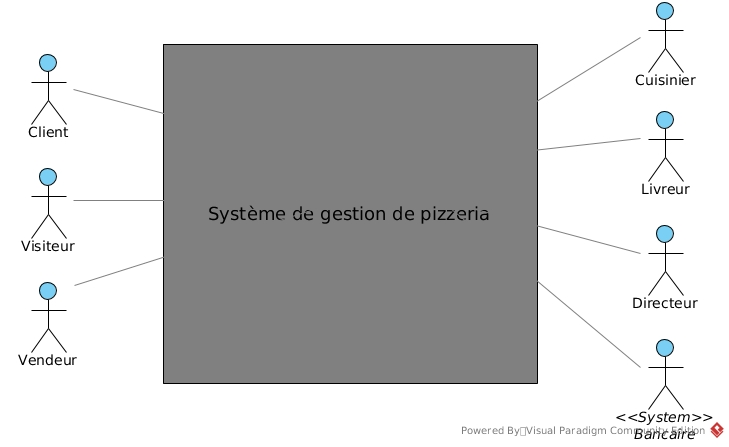
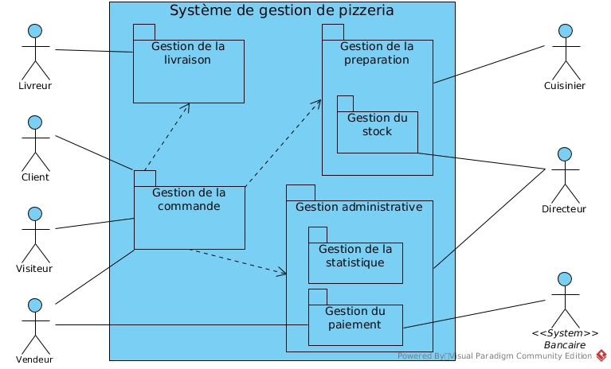
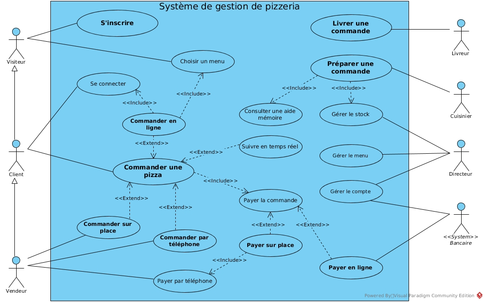
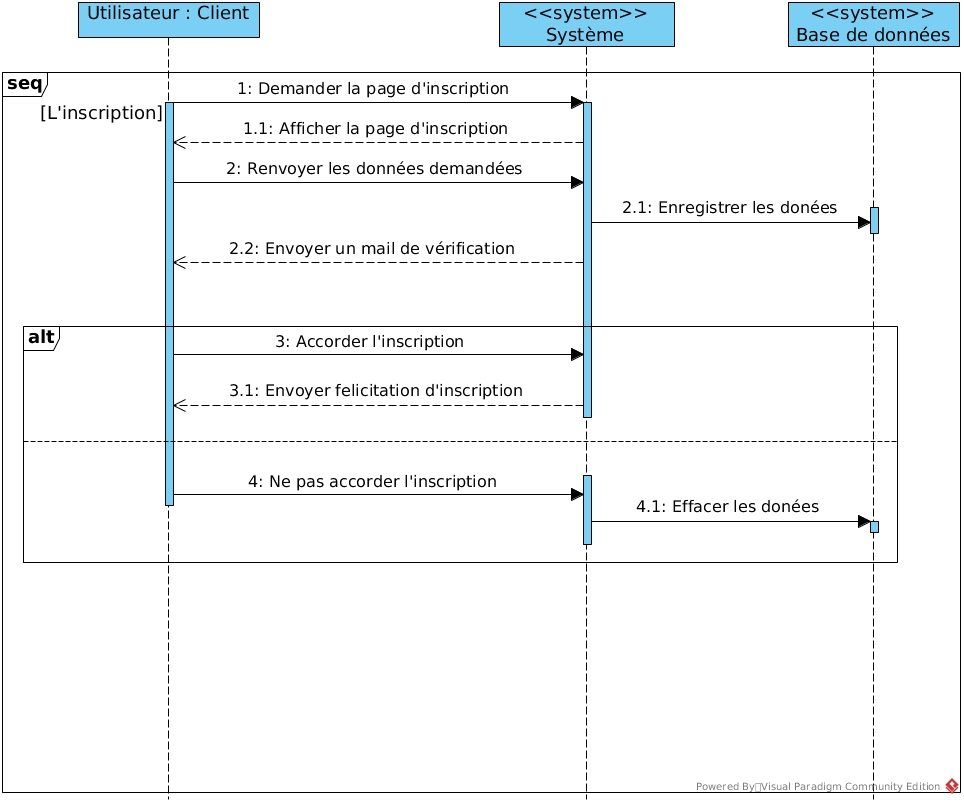
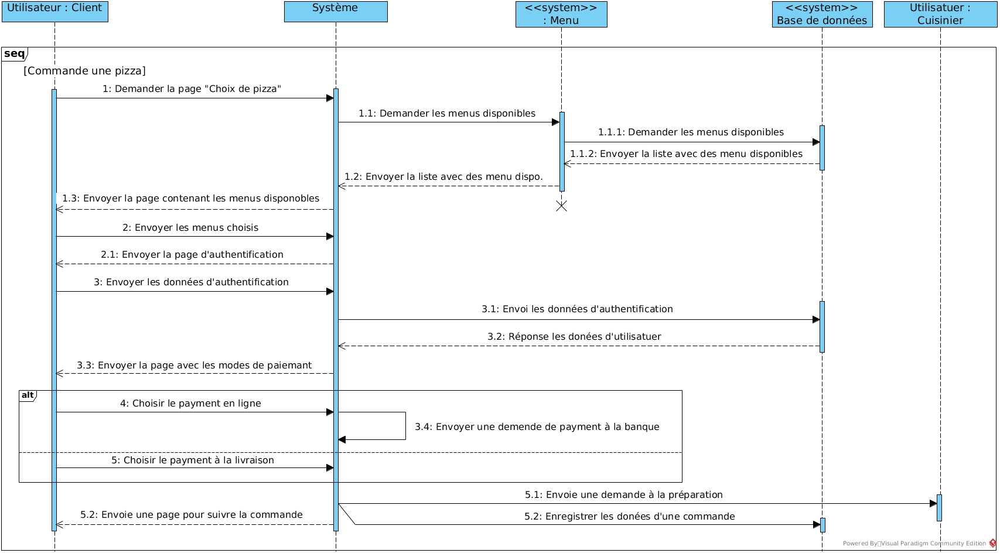
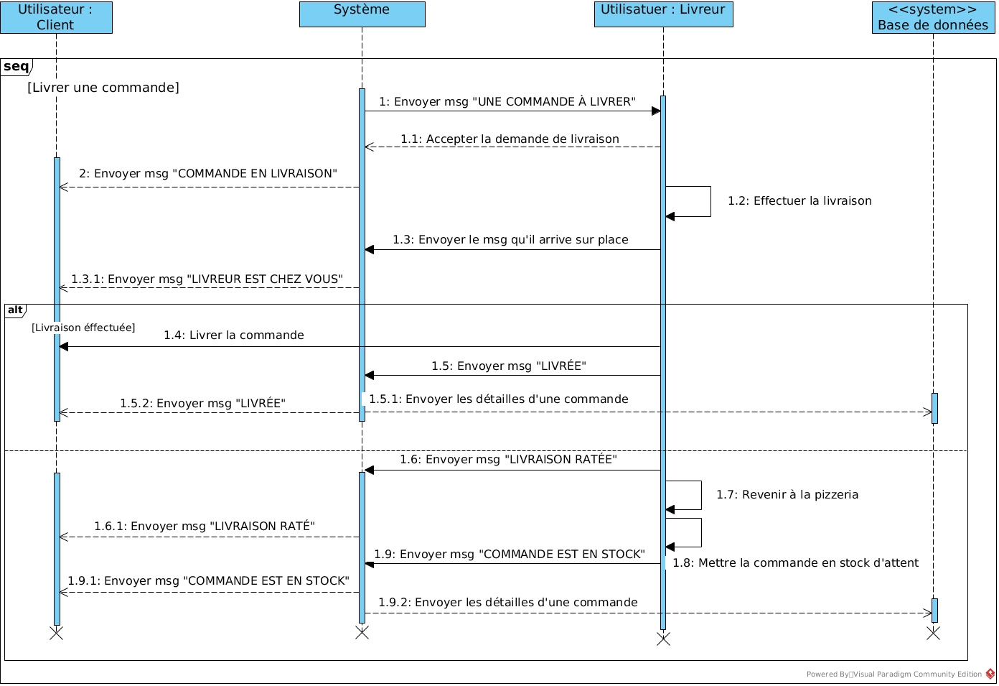
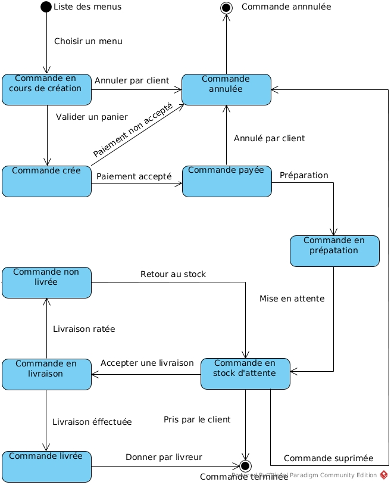
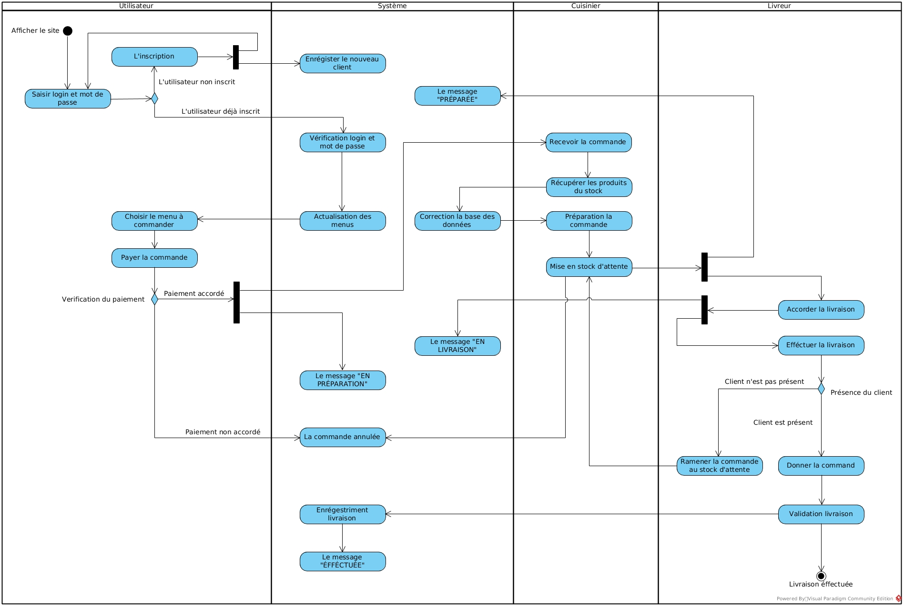

# Spécification fonctionnelles

# Analysez les besoins de votre client pour son groupe de pizzerias.

# Table of Contents
- [1. Contexte du logiciel](#1-contexte-du-logiciel)
    - [1.1 Contexte et objectif du système](#11-contexte-et-objectif-du-système)
    - [1.2 Acteurs](#12-acteurs)
- [2. Différentes parties du système](#2-différentes-parties-du-système)
- [3. Description des fonctionnalités](#3-description-des-fonctionnalités)
    - [3.1 Principales fonctionnalités du système](#31-principales-fonctionnalités-du-système)
    - [3.2 Acteurs principaux](#32-acteurs-principaux)
    - [3.3 Acteurs secondaires](#33-acteurs-secondaires)
    - [3.4 Descriptions des grandes fonctionnalité (cas d’utilisation)](#34-descriptions-des-grandes-fonctionnalité-cas-dutilisation)
- [4. Fiches descriptives des fonctionnalités principales.](#4-fiches-descriptives-des-fonctionnalités-principales)
    - [4.1 Fiche descriptive de cas d’utilisation «S'inscrire»](#41-fiche-descriptive-de-cas-dutilisation-sinscrire)
    - [4.2 Diagramme de séquence du cas d’utilisation «S'inscrire»](#42-diagramme-de-séquence-du-cas-dutilisation-sinscrire)
    - [4.3 Fiche descriptive du cas d’utilisation «Commander une pizza»](#43-fiche-descriptive-du-cas-dutilisation-commander-une-pizza)
    - [4.4 Diagramme de séquence du cas d’utilisation «Commander une pizza»](#44-diagramme-de-séquence-du-cas-dutilisation-commander-une-pizza)
    - [4.5 Fiche descriptive du cas d’utilisation «Préparer une commande»](#45-fiche-descriptive-du-cas-dutilisation-préparer-une-commande)
    - [4.6 Diagramme de séquence du cas d’utilisation «Préparer une commande»](#46-diagramme-de-séquence-du-cas-dutilisation-préparer-une-commande)
    - [4.7 Fiche descriptive du cas d’utilisation «Livrer une commande»](#47-fiche-descriptive-du-cas-dutilisation-livrer-une-commande)
    - [4.8 Diagramme de séquence du cas d’utilisation «Livrer une commande»](#48-diagramme-de-séquence-du-cas-dutilisation-livrer-une-commande)
    - [4.9 Règles fonctionnelles du système pour les utilisateurs de pizzeria.](#49-règles-fonctionnelles-du-système-pour-les-utilisateurs-de-pizzeria)
- [5 Cycle de vie d’une commande](#5-cycle-de-vie-dune-commande)
    - [5.1 Diagramme d'états-transition](#51-diagramme-détats-transition)
- [6 Flux de travail de pizzeria (Diagramme d’activités)](#6-flux-de-travail-de-pizzeria-diagramme-dactivités)

## 1. Contexte du logiciel

### 1.1 Contexte et objectif du système

**“OC Pizza”** est un jeune groupe de pizzeria en plein essor et spécialisé dans les pizzas livrées ou à emporter. Il compte déjà 5 points de vente et prévoit d’en ouvrir au moins trois de plus d’ici la fin de l’année. Un des responsables du groupe a pris contact avec vous afin de mettre en place un système informatique, déployé dans toutes les pizzerias et qui lui permettrait notamment :
*   d’être plus efficace dans la gestion des commandes, de leur réception à leur livraison en passant par leur préparation;
*   de suivre en temps réel les commandes passées et en préparation;
*   de suivre en temps réel le stock d’ingrédients restants pour savoir quelles pizzas sont encore réalisables ;
*   de proposer un site Internet pour que les clients puissent:
    *   passer leurs commandes, en plus de la prise de commande par téléphone ou sur place;
    *   payer en ligne leur commande s’ils le souhaitent – sinon, ils paieront directement à la livraison;
    *   modifier ou annuler leur commande tant que celle-ci n’a pas été préparée;
*   de proposer un aide mémoire aux pizzaiolos indiquant la recette de chaque pizza;

La figure ci-dessous sert à délimiter le contour du système en cours d'étude, et définir clairement ses frontières et les acteurs avec lesquels il communique. Ces derniers peuvent être soient des acteurs humaines ou non-humaines, soient d'autres systèmes avec lequel le futur système communique.

            Figure 1: Diagramme de contexte

Dans la **Figure 1** on constate qu’il existe 7 acteurs humaines et non-humaines qui interagissent avec le système (Le site internet de commande de pizza).

### 1.2 Acteurs

**Les acteurs principaux:**

*   **Le visiteur** doit pouvoir s’inscrire sur le site et éventuellement consulter les produits et remplir le panier.
*   **Le client** doit pouvoir consulter les produits, remplir le panier et effectuer un achat en ligne.
*   **Le vendeur** doit pouvoir recevoir les commandes par l’appelle téléphonique, effectuer le paiement par téléphone et sur place.
*   **Le cuisinier** doit pouvoir recevoir des commandes payées, changer le quantité de stock (en récupérant des produits nécessaires), envoyer des commandes préparées au service de livraison.
*   **Le livreur** doit pouvoir recevoir des commandes préparées à la livraison, faire le rendre compte au système du résultat de livraison.
*   **Le directeur** peut voir la statistique** **de vente, le produit mieux vendu, les chiffres d’affaires par certaine durée et éventuellement vérifier le quantités des produits en stock, pour pouvoir le remplir.

**Les acteurs secondaires:**

*   **Le système bancaire** (l'acteur non-humaine) est nécessaire pour pouvoir payer une commande en ligne.

## 2. Différentes parties du système
Le système est découpé en quatre packages principales dont chacun représente sa propre partie du système.

Le diagramme de package de la **Figure 2** permet de décomposer le système en catégories ou parties plus facilement observables, appelés ”packages”. Cela permet également d’indiquer les acteurs qui interviennent dans chacun des packages.

        Figure 2: Diagramme de package

Dans la figure précédent, nous voyons que le logiciel que nous concevons peut être divisé en quatre parties (ou packages) observables séparément:

*   La partie **Gestion de la commande** contient l’inscription des nouveaux utilisateurs et la cycle de vie de la commande. Elle initialize aussi la commande.
*   La partie **Gestion de la préparation** contient la fonctionnalité pour préparer la commande.
    *   Le package **Gestion du stock** qui répondre sur enlèvement et complément du stock.
*   La partie **Gestion de la livraison** gère les commandes prête à livrer, éventuellement elle les distribue par des livreur. Elle termine le cycle de vie d’une commande livrée ou non-livrée.
*   La partie **Gestion administrative** regroupe plusieurs fonctionnalités comme: la modification le catalogue de produits et les menu.
    *   La sous-partie **Gestion de la statistique** contient les position mieux vendu et les chiffres d’affaires.
    *   La sous-partie **Gestion du paiement** gère éventuellement le paiement en-ligne.
*   La boîte **“Pizzeria”** qui entoure les packages (la boîte bleue) correspond au système (c’est-à-dire le logiciel) qui est analysé.

## 3. Description des fonctionnalités

### 3.1 Principales fonctionnalités du système

Le système de gestion de pizzeria contient plusieurs fonctionnalités. Les principales fonctionnalités sont présentées à travers un diagramme de cas d’utilisation qui représente les fonctionnalités (ou dit cas d’utilisation) nécessaires aux utilisateurs et les acteurs qui interagissent avec leurs fonctionnalités. Elle est illustrée dans la **Figure 3**.

        Figure 3 : diagramme de cas d’utilisation

### 3.2 Acteurs principaux

*   **Visiteur** est un acteur principal qui n'est pas encore enregistré, chaque usager du système et défini comme “Utilisateur” lors de sa première visite sur le site. Il peut **s’inscrire** ou éventuellement **choisir un menu** pour commander en ligne, mais il ne peut pas le commander sans l’inscription.
*   **Client** est un acteur déjà inscrit, il peut **se connecter** sur le site, **choisir un menu** à commander et **effectuer le paiement en ligne** pour sa commande. Après la livraison il recevra la notification de livraison effectuée ou non-effectuée.
*   **Vendeur** peut recevoir les **commandes par appelle** téléphonique, il est capable de **créer la nouvelle commande** par téléphone en récupérant l’adresse de client, ses menus choisi et **effectué le paiement **sur place ou **par téléphone**.
*   **Cuisinier** **reçoit la liste** des commandes à préparer, **récupère des produits** nécessaires du stock et également il **change des quantités** des produits restants. Il **prépare des commandes** et à la fin il **envoie le message** au livreur que la commande est prête-à-livrer. Et **mettre** la commande préparée **au stock d'attente**. Et éventuellement il a l'accès aux aides mémoires pour les recettes des pizzas.
*   **Livreur** **reçoit le message** avec les détailles d’une commande placée en stock d’attente. Il **livre la commande** acceptée. Après une livraison bien effectuée il envoit le **message de confirmation** et éventuellement il **reçoit de l’argent** des clients qui veulent payer à la livraison. Mais si le client est absent, il **remet** la commande **au stock d’attente**.
*   **Directeur il ne participe pas au cycle de vie** d’une commande. Il peut **voir la statistique** des ventes et **chiffres d'offres** et éventuellement **changer la liste des menus** proposés.

### 3.3 Acteurs secondaires

*   **<<Système>> Bancaire** reçoit les transactions pour les commandes payer en ligne, et envoie un message de confirmation au système, pour passer à l’étape de préparation.

### 3.4 Descriptions des grandes fonctionnalité (cas d’utilisation)

*   **Commander une pizza** est un cas d’utilisation qui initialize cycle du vie d’une commande. Il permet de choisir un menu et si nécessaire demander un utilisateur de faire la connection.
    *   **<<Extend\>> Commander sur place** est un cas d’utilisation qui étend le cas précédent, il permet de commander un menu sans faire la connection ou l’inscription.
    *   **<<Extend\>> Commander par téléphone** est un cas d’utilisation qui étend le cas précédent, il permet de commander un menu par appelle téléphonique sans faire la connection ou l’inscription.
    *   **<<Extend\>> Commander en ligne** est un cas d’utilisation qui étend le cas précédent. Il permet de faire la commande en ligne dans ce cas il nécessite faire la connection avant de passer à l’étape de paiement.
        *   **<<Include\>> Se connecter** est un cas d’utilisation qui nous permet de se connecter si nous avons déjà inscrit.
        *   **<<Include\>> Choisir un menu** permet de remplir le panier en choisissant les menu disponibles. Il ne nécessite pas avoir une inscription ou connection.
    *   **<<Extend\>> Suivre en temps réél** est un cas d’utilisation qui étend le cas précédent, il permet de suivre une commande en temps réel.
    *   **<<Include\>> Payer la commande** est un cas d’utilisation qui nous propose plusieur moyens de paiement, il finalize la commande et l’envoie à l’étape de préparation.
        *   **<<Extend\>> Payer sur place** est un cas d’utilisation qui étend le cas précédent. Il permet de faire un paiement par espèce ou par carte directement au pizzeria, il sert surtout pour les commande sur place.
            *   **<<Include\>> Payer par téléphone** est un cas d’utilisation qui étend le cas précédent. Il permet de faire un paiement par carte en appelant au pizzeria, il sert surtout pour les commande par téléphone.
        *   **<<Extend\>> Payer en ligne** est un cas d’utilisation qui étend le cas précédent. Il permet de régler une commande en ligne en faisant la connexion avec la banque.
*   **S’inscrire** est un cas d’utilisation qui est responsable de l’inscription. Il gère le processus d'enregistrement pour les nouveaux utilisateurs non-inscrits.
*   **Préparer une commande** est un cas d’utilisation qui gère la préparation d’une commande après le règlement. Il prévoit le cuisinier par le message envoyé pour qu’il puisse commencer la préparation d’une commande.
    *   **<<Include\>> Gérer le stock** c’est le cas d'utilisation qui permet de changer la quantité des produit au stock pendant la phase de préparation ou pour le remplissage de stock.
    *   **<<Include\>> Consulter une aide mémoire** est un cas d’utilisation qui aide au cuisinier, il le fait montrer les recettes des pizza en préparation.
*   **Livrer une commande** est responsable de la dernière phase de cycle de vie d’une commande. Il suive la livraison et envoie le message au client que sa commande est arrivée chez lui.
*   **Gérer le menu** se permet de changer le menu du pizzeria en dépendant de choix de directeur. Il n’appartient pas au cycle de vie d’une commande.
*   **Gérer le compte** permet de gérer le mouvement des paiements, voir les produits mieux vendus et les dépenses / revenus générales du pizzeria.

## 4. Fiches descriptives des fonctionnalités principales.

### 4.1 Fiche descriptive de cas d’utilisation «S'inscrire»

**Identification:**

<table>
  <tr>
   <td><strong>Numéro</strong>
   </td>
   <td>1
   </td>
  </tr>
  <tr>
   <td><strong>Nom</strong>
   </td>
   <td>S’inscrire (package “Gestion de la commande”)
   </td>
  </tr>
  <tr>
   <td><strong>Auteur (s)</strong>
   </td>
   <td>Visiteur
   </td>
  </tr>
  <tr>
   <td><strong>Description succinct</strong>
   </td>
   <td>L’inscription doit être possible pour un visiteur qui n’est pas encore inscrit. L’inscription pour un visiteur déjà inscrit est impossible.
   </td>
  </tr>
  <tr>
   <td><strong>Auteur</strong>
   </td>
   <td>******
   </td>
  </tr>
  <tr>
   <td><strong>Date</strong>
   </td>
   <td>23/11/2018 (dernière rédaction)
   </td>
  </tr>
  <tr>
   <td><strong>Pré-condition</strong>
   </td>
   <td>Aucune
   </td>
  </tr>
  <tr>
   <td><strong>Démarrage</strong>
   </td>
   <td>Le visiteur a demandé la page “L’inscription”
   </td>
  </tr>
</table>

**Le dialogue: le scénario nominal**

<table>
  <tr>
   <td><strong>Étape du scénario</strong>
   </td>
   <td><strong>Utilisateur</strong>
   </td>
   <td><strong>Système</strong>
   </td>
  </tr>
  <tr>
   <td>1.
   </td>
   <td>
   </td>
   <td>Il affiche une page contenant la forme d’inscription.
   </td>
  </tr>
  <tr>
   <td>2.
   </td>
   <td>Il remplit les données nécessaires:
    <ul>
        <li>NOM
        <li>PRÉNOM
        <li>EMAIL
        <li>MOT DE PASSE
        <li>ADRESSE
        <li>CARTE BANCAIRE (sauvegarde par choix)
    </li>
    </ul>
   </td>
   <td>
   </td>
  </tr>
  <tr>
   <td>3.
   </td>
   <td>
   </td>
   <td>Il envoie un mail afin de vérifier son adresse mail et finaliser l’inscription.
   </td>
  </tr>
  <tr>
   <td>4.
   </td>
   <td>Il verifier son mail et accorder l’inscription.
   </td>
   <td>
   </td>
  </tr>
  <tr>
   <td>5.
   </td>
   <td>
   </td>
   <td>Il affiche une page contenant la félicitation d’inscription et il fait l’auto-authentification.
   </td>
  </tr>
</table>

**Le dialogue: le scénarios alternatif**

<table>
  <tr>
   <td><strong>Étape du scénario</strong>
   </td>
   <td><strong>Utilisateur</strong>
   </td>
   <td><strong>Système</strong>
   </td>
  </tr>
  <tr>
   <td>3.1.1
   </td>
   <td>L'utilisateur appuyer le bouton que le mail a été envoyé par erreur.
   </td>
   <td>
   </td>
  </tr>
  <tr>
   <td>3.1.2
   </td>
   <td>
   </td>
   <td>Il efface toutes les données pré-remplis et envoie un mail avec des regrets.
   </td>
  </tr>
  <tr>
   <td>3.2.1
   </td>
   <td>L’utilisateur n’est pas accepté le mail pendant 24 heures.
   </td>
   <td>
   </td>
  </tr>
  <tr>
   <td>3.2.2
   </td>
   <td>
   </td>
   <td>Il efface toutes les données pré-remplis. Il n’envoie pas un mail encore une fois car l’address peut être ne pas correct.
   </td>
  </tr>
</table>

<table>
  <tr>
   <td><strong>Fin de scénario nominal</strong>
   </td>
   <td>Aux points 2, 4 sur décision de l’utilisateur
   </td>
  </tr>
  <tr>
   <td><strong>Fin de scénario alternatif</strong>
   </td>
   <td>Au point 3.1.1 sur décision de l’utilisateur.
    
Au point 3.1.2 sur décision de système.

   </td>
  </tr>
  <tr>
   <td><strong>Post-condition de scénario nominal</strong>
   </td>
   <td>Le nouveau utilisateur a été enregistré en base de données.
   </td>
  </tr>
  <tr>
   <td><strong>Post-condition de scénario alternatif</strong>
   </td>
   <td>Toutes les données doivent être effacer de la base de données
   </td>
  </tr>
</table>

### 4.2 Diagramme de séquence du cas d’utilisation «S'inscrire»

Le diagramme de séquence est la partie de l’aspect fonctionnel qui nommé vue des processus, Il nous permet de décrire les différents scénarios d’utilisation du système, la décomposition du système en processus et actions, les interactions entre les processus, la synchronisation et la communication des activités parallèles.

Sur la **Figure 4.1** ci-dessous on voit le processus d’inscription de nouveau utilisateur et ses interactions avec le système et la base des données.

        Figure 4.1 : Diagramme de séquence du cas d’utilisation “S’inscrire”

### 4.3 Fiche descriptive du cas d’utilisation «Commander une pizza»

**Identification:**

<table>
  <tr>
   <td><strong>Numéro</strong>
   </td>
   <td>2
   </td>
  </tr>
  <tr>
   <td><strong>Nom</strong>
   </td>
   <td>Commander une pizza (package “Gestion de la commande”)
   </td>
  </tr>
  <tr>
   <td><strong>Auteur (s)</strong>
   </td>
   <td>Client ou Vendeur
   </td>
  </tr>
  <tr>
   <td><strong>Description succinct</strong>
   </td>
   <td>Le commande une pizza doit être possible pour un client déjà inscrit ou un vendeur.
   </td>
  </tr>
  <tr>
   <td><strong>Auteur</strong>
   </td>
   <td>******
   </td>
  </tr>
  <tr>
   <td><strong>Date</strong>
   </td>
   <td>23/11/2018 (dernière rédaction)
   </td>
  </tr>
  <tr>
   <td><strong>Pré-condition</strong>
   </td>
   <td>L’utilisateur doit être authentifié en tant que client ou vendeur
   </td>
  </tr>
  <tr>
   <td><strong>Démarrage</strong>
   </td>
   <td>l’utilisateur a demandé la page “Commander un pizza”
   </td>
  </tr>
</table>

**Le dialogue: le scénario nominal**

<table>
  <tr>
   <td><strong>Étape du scénario</strong>
   </td>
   <td><strong>Utilisateur</strong>
   </td>
   <td><strong>Système</strong>
   </td>
  </tr>
  <tr>
   <td>
    1.
   </td>
   <td>
    </td>
   <td>Il affiche une page contenant les menu disponible.
   </td>
  </tr>
  <tr>
   <td>2.
   </td>
   <td>Ajouter un menu dans le panier.
   </td>
   <td>
   </td>
  </tr>
  <tr>
   <td>3.
   </td>
   <td>Finaliser la commande en appuyant le bouton “COMMANDER”
   </td>
   <td>
   </td>
  </tr>
  <tr>
   <td>4.
   </td>
   <td>
   </td>
   <td>Il affiche une page contenant la forme d’authentification
   </td>
  </tr>
  <tr>
   <td>5.
   </td>
   <td>S'authentifier
   </td>
   <td>
   </td>
  </tr>
  <tr>
   <td>6.
   </td>
   <td>
   </td>
   <td>Il affiche la page contenant les modes de paiement.
<ul>
<li>EN LIGNE
<li>À LA LIVRAISON
</li>
</ul>
   </td>
  </tr>
  <tr>
   <td>7.
   </td>
   <td>Choisir le mode en appuyant le bouton “PAYER”
   </td>
   <td>
   </td>
  </tr>
  <tr>
   <td>8.
   </td>
   <td>Effectuer le paiement en ligne
   </td>
   <td>
   </td>
  </tr>
  <tr>
   <td>9.
   </td>
   <td>
   </td>
   <td>Vérification la possibilité de paiement à la banque
   </td>
  </tr>
  <tr>
   <td>10.
   </td>
   <td>
   </td>
   <td>Il envoie le demande de préparation pour le menu décidé à la cuisin et enregistre la commande en base de données
   </td>
  </tr>
  <tr>
   <td>11.
   </td>
   <td>
   </td>
   <td>Il affiche la page pour suivre le commande en temps réel.
   </td>
  </tr>
</table>

**Le dialogue: le scénarios alternatif**

<table>
  <tr>
   <td><strong>Étape du scénario</strong>
   </td>
   <td><strong>Utilisateur</strong>
   </td>
   <td><strong>Système</strong>
   </td>
  </tr>
  <tr>
   <td>2.1.1
   </td>
   <td>Il peut effacer un menu du panier
   </td>
   <td>
   </td>
  </tr>
  <tr>
   <td>5.1.1
   </td>
   <td>Si Il ne s’est pas encore inscrit, il peut appuyer le bouton “L’INSCRIPTION”
   </td>
   <td>
   </td>
  </tr>
  <tr>
   <td>5.1.2
   </td>
   <td>
   </td>
   <td>Passer au cas d’utilisation №1 “S'inscrire”
   </td>
  </tr>
  <tr>
   <td>7.1.1
   </td>
   <td>Si il choisit “paiement à la livraison”
   </td>
   <td>
   </td>
  </tr>
  <tr>
   <td>7.1.2
   </td>
   <td>
   </td>
   <td>Il envoie la demande de préparation pour le menu choisi à la cuisin
   </td>
  </tr>
  <tr>
   <td>7.1.3
   </td>
   <td>
   </td>
   <td>Il affiche la page pour suivre le commande en temps réel
   </td>
  </tr>
  <tr>
   <td>9.1.1
   </td>
   <td>
   </td>
   <td>La banque a refusée la transaction
   </td>
  </tr>
  <tr>
   <td>9.1.2
   </td>
   <td>
   </td>
   <td>Envoie le message à l’utilisateur que le paiement n’a pas été effectué
   </td>
  </tr>
</table>

<table>
  <tr>
   <td><strong>Fin de scénario nominal</strong>
   </td>
   <td>Aux points 2, 3, 5, 7, 8 sur décision de l’utilisateur
   </td>
  </tr>
  <tr>
   <td><strong>Fin de scénario alternatif</strong>
   </td>
   <td>Aux points 2.1.1, 5.1.1, 7.1.1 sur décision de l’utilisateur.

Au point 9.1.2 sur décision de système.
   </td>
  </tr>
  <tr>
   <td><strong>Post-condition de scénario nominal</strong>
   </td>
   <td>La commande a été enregistré en base de données.
   </td>
  </tr>
  <tr>
   <td><strong>Post-condition de scénario alternatif</strong>
   </td>
   <td>La commande inachevée a été enregistrée en base de données avec la nature d'erreur
   </td>
  </tr>
</table>

### 4.4 Diagramme de séquence du cas d’utilisation «Commander une pizza»

        Figure 4.2 : Diagramme de séquence du cas d’utilisation “Commander une pizza”

### 4.5 Fiche descriptive du cas d’utilisation «Préparer une commande»

**Identification:**

<table>
  <tr>
   <td><strong>Numéro</strong>
   </td>
   <td>3
   </td>
  </tr>
  <tr>
   <td><strong>Nom</strong>
   </td>
   <td>Préparer une commande (package “Gestion de la préparation”)
   </td>
  </tr>
  <tr>
   <td><strong>Auteur (s)</strong>
   </td>
   <td>Cuisinier
   </td>
  </tr>
  <tr>
   <td><strong>Description succinct</strong>
   </td>
   <td>La préparation d’une commande doit être commencer après la réception une notification du système par le cuisinier.
   </td>
  </tr>
  <tr>
   <td><strong>Auteur</strong>
   </td>
   <td>******
   </td>
  </tr>
  <tr>
   <td><strong>Date</strong>
   </td>
   <td>23/11/2018 (dernière rédaction)
   </td>
  </tr>
  <tr>
   <td><strong>Pré-condition</strong>
   </td>
   <td>L’utilisateur doit être authentifié en tant que le cuisinier
   </td>
  </tr>
  <tr>
   <td><strong>Démarrage</strong>
   </td>
   <td>Le système envoie une notification au cuisinier
   </td>
  </tr>
</table>

**Le dialogue: le scénario nominal**

<table>
  <tr>
   <td><strong>Étape du scénario</strong>
   </td>
   <td><strong>Cuisinier</strong>
   </td>
   <td><strong>Système</strong>
   </td>
  </tr>
  <tr>
   <td>1.
   </td>
   <td>
   </td>
   <td>Il envoie une notification au cuisinier avec les détailles d’une commande.
   </td>
  </tr>
  <tr>
   <td>2.
   </td>
   <td>Il récupère les produits nécessaires pour préparer la commande et il envoie la quantité des produits récupérés.
   </td>
   <td>
   </td>
  </tr>
  <tr>
   <td>3.
   </td>
   <td>Il envoie un message au système que la commande “EN PRÉPARATION”.
   </td>
   <td>Il reconstruit le menu en vertu du stock changé par le cuisinier.
   </td>
  </tr>
  <tr>
   <td>4.
   </td>
   <td>Il prépare une commande.
   </td>
   <td>Il affiche un message pour client que sa commande en préparation.
   </td>
  </tr>
  <tr>
   <td>5.
   </td>
   <td>Il termine la commande et envoie un message au système que la commande est prête
   </td>
   <td>
   </td>
  </tr>
  <tr>
   <td>6.
   </td>
   <td>
   </td>
   <td>Il envoie un message au livreur qu’il y a une commande à livrer.
   </td>
  </tr>
  <tr>
   <td>7.
   </td>
   <td>
   </td>
   <td>Il envoie un message au client que sa commande est prête
   </td>
  </tr>
</table>

**Le dialogue: le scénarios alternatif**

<table>
  <tr>
   <td><strong>Étape du scénario</strong>
   </td>
   <td><strong>Cuisinier</strong>
   </td>
   <td><strong>Système</strong>
   </td>
  </tr>
  <tr>
   <td>6.1.1
   </td>
   <td>
   </td>
   <td>Si le client a décidé de récupérer sa commande au pizzeria, il envoie un message au client qu’il puisse récupérer sa commande.
   </td>
  </tr>
</table>

<table>
  <tr>
   <td><strong>Fin de scénario nominal</strong>
   </td>
   <td>Au point 6 sur décision de système
   </td>
  </tr>
  <tr>
   <td><strong>Fin de scénario alternatif</strong>
   </td>
   <td>Au point 6.1.1 sur décision de système.
   </td>
  </tr>
  <tr>
   <td><strong>Post-condition de scénario nominal</strong>
   </td>
   <td>Les modifications d’une commande ont été ajoutées en base de données.
   </td>
  </tr>
  <tr>
   <td><strong>Post-condition de scénario alternatif</strong>
   </td>
   <td>Les modifications d’une commande ont été ajoutées en base de données.
   </td>
  </tr>
</table>

### 4.6 Diagramme de séquence du cas d’utilisation «Préparer une commande»

Sur la **Figure 4.3** ci-dessous on voit le processus de préparation de nouvelle commande par le cuisinier et ses interactions avec le système et la base des données. A la fin de processus le système envoie le message au client et le livreur (optionnel) pour commencer la phase de livraison.

        Figure 4.3 : Diagramme de séquence du cas d’utilisation “Préparer une commande”

### 4.7 Fiche descriptive du cas d’utilisation «Livrer une commande»

**Identification:**

<table>
  <tr>
   <td><strong>Numéro</strong>
   </td>
   <td>4
   </td>
  </tr>
  <tr>
   <td><strong>Nom</strong>
   </td>
   <td>Livrer une commande (package “Gestion de la livraison”)
   </td>
  </tr>
  <tr>
   <td><strong>Auteur (s)</strong>
   </td>
   <td>Livreur
   </td>
  </tr>
  <tr>
   <td><strong>Description succinct</strong>
   </td>
   <td>La livraison d’une commande doit être commencer après la réception d’une notification du système par le livreur.
   </td>
  </tr>
  <tr>
   <td><strong>Auteur</strong>
   </td>
   <td>******
   </td>
  </tr>
  <tr>
   <td><strong>Date</strong>
   </td>
   <td>23/11/2018 (dernière rédaction)
   </td>
  </tr>
  <tr>
   <td><strong>Pré-condition</strong>
   </td>
   <td>L’utilisateur doit être authentifié en tant que le livreur
   </td>
  </tr>
  <tr>
   <td><strong>Démarrage</strong>
   </td>
   <td>Le système envoie une notification au livreur
   </td>
  </tr>
</table>

**Le dialogue: le scénario nominal**

<table>
  <tr>
   <td><strong>Étape du scénario</strong>
   </td>
   <td><strong>Livreur</strong>
   </td>
   <td><strong>Système</strong>
   </td>
  </tr>
  <tr>
   <td>1.
   </td>
   <td>
   </td>
   <td>Il envoie une notification au livreur avec les détailles nécessaire pour une livraison.
   </td>
  </tr>
  <tr>
   <td>2.
   </td>
   <td>Il accepte la demande de livraison.
   </td>
   <td>
   </td>
  </tr>
  <tr>
   <td>3.
   </td>
   <td>Il livre la commande.
   </td>
   <td>Il affiche le message pour le client “COMMANDE EN LIVRAISON”.
   </td>
  </tr>
  <tr>
   <td>4.
   </td>
   <td>En arrivant chez le client il envoie un message qu'il est sur place.
   </td>
   <td>
   </td>
  </tr>
  <tr>
   <td>5.
   </td>
   <td>
   </td>
   <td>Il envoie le message au client “LIVREUR EST CHEZ LUI”.
   </td>
  </tr>
  <tr>
   <td>6.
   </td>
   <td>Il donne la commande au client est envoie le message “LIVRÉ” au système.
   </td>
   <td>
   </td>
  </tr>
  <tr>
   <td>7.
   </td>
   <td>
   </td>
   <td>Il affiche le message pour le client que sa commande est “LIVRÉ”.
   </td>
  </tr>
  <tr>
   <td>8.
   </td>
   <td>
   </td>
   <td>Il sauvegarde les détailles d’une commande au base de donné.
   </td>
  </tr>
</table>

**Le dialogue: le scénarios alternatif**

<table>
  <tr>
   <td><strong>Étape du scénario</strong>
   </td>
   <td><strong>Livreur</strong>
   </td>
   <td><strong>Système</strong>
   </td>
  </tr>
  <tr>
   <td>4
   </td>
   <td>En arrivant chez le client il envoie un message qu'il est sur place.
   </td>
   <td>
   </td>
  </tr>
  <tr>
   <td>4.1.1
   </td>
   <td>Le client n’est pas descendu pour récupérer sa commande pendant 15 minutes.
   </td>
   <td>
   </td>
  </tr>
  <tr>
   <td>4.1.2
   </td>
   <td>Il envoie message “LIVRAISON RATÉE”.
   </td>
   <td>
   </td>
  </tr>
  <tr>
   <td>4.1.3
   </td>
   <td>Il revient au pizzeria est mettre la commande sur le stock d’attent.
   </td>
   <td>Il envoie un message au client qu’il n’étais pas présent. Et il peut récupérer sa commande au pizzeria.
   </td>
  </tr>
  <tr>
   <td>4.1.4
   </td>
   <td>
   </td>
   <td>Il sauvegarde les détailles d’une commande au base de donné.
   </td>
  </tr>
</table>

<table>
  <tr>
   <td><strong>Fin de scénario nominal</strong>
   </td>
   <td>Au point 8 sur décision de système
   </td>
  </tr>
  <tr>
   <td><strong>Fin de scénario alternatif</strong>
   </td>
   <td>Au point 4.1.4 sur décision de système.
   </td>
  </tr>
  <tr>
   <td><strong>Post-condition de scénario nominal</strong>
   </td>
   <td>L’information concernant la commande ont été ajoutées en base de données.
   </td>
  </tr>
  <tr>
   <td><strong>Post-condition de scénario alternatif</strong>
   </td>
   <td>L’information concernant la commande ont été ajoutées en base de données. La commande est en stock d’attent
   </td>
  </tr>
</table>

### 4.8 Diagramme de séquence du cas d’utilisation «Livrer une commande»

Sur la **Figure 4.4** ci-dessous on voit le processus de livraison d’une commande au client par le livreur ou par la récupération sa commande par lui-même et leurs interactions avec le système et la base des données. C’est le processus final pour la commande entier.

        Figure 4.4 : Diagramme de séquence du cas d’utilisation “Livrer une commande”

### 4.9 Règles fonctionnelles du système pour les utilisateurs de pizzeria.

<table>
  <tr>
   <td>
   </td>
   <td><strong>UTILISATEURS</strong>
   </td>
   <td rowspan="2" ><strong>VISITEUR</strong>
   </td>
   <td rowspan="2" ><strong>CLIENT</strong>
   </td>
   <td rowspan="2" ><strong>VENDEUR</strong>
   </td>
   <td rowspan="2" ><strong>CUISINIER</strong>
   </td>
   <td rowspan="2" ><strong>LIVREUR</strong>
   </td>
   <td rowspan="2" ><strong>DIRECTEUR</strong>
   </td>
  </tr>
  <tr>
   <td><strong>FONCTIONS</strong>
   </td>
   <td>
   </td>
  </tr>
  <tr>
   <td colspan="2" >

<strong>S'INSCRIRE</strong>

<strong>(Nom, Prénom, Email, Mot de passe, Address, Carte bancaire)</strong>

   </td>
   <td><strong>X</strong>
   </td>
   <td>
   </td>
   <td>
   </td>
   <td>
   </td>
   <td>
   </td>
   <td>
   </td>
  </tr>
  <tr>
   <td colspan="2" >

<strong>SE CONNECTER</strong>

<strong>(Email, Mot de passe)</strong>

   </td>
   <td>
   </td>
   <td><strong>X</strong>
   </td>
   <td><strong>X</strong>
   </td>
   <td><strong>X</strong>
   </td>
   <td><strong>X</strong>
   </td>
   <td><strong>X</strong>
   </td>
  </tr>
  <tr>
   <td colspan="2" >

<strong>SE DÉCONNECTER</strong>

   </td>
   <td>
   </td>
   <td><strong>X</strong>
   </td>
   <td><strong>X</strong>
   </td>
   <td><strong>X</strong>
   </td>
   <td><strong>X</strong>
   </td>
   <td><strong>X</strong>
   </td>
  </tr>
  <tr>
   <td colspan="2" >

<strong>CHOISIR UN MENU</strong>

   </td>
   <td><strong>X</strong>
   </td>
   <td><strong>X</strong>
   </td>
   <td><strong>X</strong>
   </td>
   <td>
   </td>
   <td>
   </td>
   <td>
   </td>
  </tr>
  <tr>
   <td colspan="2" >

<strong>PAYER UN MENU</strong>

   </td>
   <td>
   </td>
   <td><strong>X</strong>
   </td>
   <td><strong>X</strong>
   </td>
   <td>
   </td>
   <td>
   </td>
   <td>
   </td>
  </tr>
  <tr>
   <td colspan="2" >

<strong>RECEVOIR LES COMMANDES À PRÉPARER</strong>

   </td>
   <td>
   </td>
   <td>
   </td>
   <td>
   </td>
   <td><strong>X</strong>
   </td>
   <td>
   </td>
   <td>
   </td>
  </tr>
  <tr>
   <td colspan="2" >

<strong>CHANGER LA QUANTITÉ DES PRODUITS AU STOCK</strong>

   </td>
   <td>
   </td>
   <td>
   </td>
   <td>
   </td>
   <td><strong>X</strong>
   </td>
   <td>
   </td>
   <td><strong>X</strong>
   </td>
  </tr>
  <tr>
   <td colspan="2" >

<strong>RECEVOIR DES COMMANDES À LIVRER</strong>

   </td>
   <td>
   </td>
   <td>
   </td>
   <td>
   </td>
   <td>
   </td>
   <td><strong>X</strong>
   </td>
   <td>
   </td>
  </tr>
  <tr>
   <td colspan="2" >

<strong>METTRE UNE COMMANDE AU STOCK D’ATTENTE</strong>

   </td>
   <td>
   </td>
   <td>
   </td>
   <td>
   </td>
   <td><strong>X</strong>
   </td>
   <td><strong>X</strong>
   </td>
   <td>
   </td>
  </tr>
  <tr>
   <td colspan="2" >

<strong>GESTION DU MENU</strong>

   </td>
   <td>
   </td>
   <td>
   </td>
   <td>
   </td>
   <td>
   </td>
   <td>
   </td>
   <td><strong>X</strong>
   </td>
  </tr>
  <tr>
   <td colspan="2" >

<strong>GESTION DU COMPTE</strong>

   </td>
   <td>
   </td>
   <td>
   </td>
   <td>
   </td>
   <td>
   </td>
   <td>
   </td>
   <td><strong>X</strong>
   </td>
  </tr>
</table>

## 5 Cycle de vie d’une commande

### 5.1 Diagramme d'états-transition

Le diagramme d’état-transition permet de décrire le cycle de vie des objets d’une classe, décrire comment un objet change d'état au cours de son existence, représenter des objets liés à un événement dans un système réactif.

Sur la **Figure 5** ci-dessous on voit le cycle de vie d’une commande qui commence par afficher la liste de menu pour un client et qui peut se terminer soit par annulation manuelle par client soit par la préparation et livraison au client ou par la récupération la commande au pizzeria par le client directement.

            Figure 5 : Diagramme d'états-transition

*   **“Liste de menu”** Le cycle de vie commence par le chargement la list de menu disponible par le client.
    *   **“Choisir un menu” **L’utilisateur choisit un menu et il en ajoute dans son panier.
*   L’état **“Commande en cours de création”** le client a déjà remplit le panier, mais il ne l’est pas encore validé.
    *   **“Annulé par client”** Le client peut annuler sa commande, et terminer sa session.
    *   **“Valider un panier”** Le client valide la commande pour passer à l’état suivant.
*   L’état **“Commande créée”**, le client est validé son panier et il doit choisir un moyen de paiement et le confirmer.
    *   **“Paiement accepté”** Le paiement a été acceptée par le système bancaire et la commande peut changer son état.
    *   **“Paiement non accepté”** Si le paiement n’est pas acceptée la commande passe en état “Commande annulée”.
*   L’état **“Commande payée”**, la commande payée en attend l’acceptation par le cuisinier.
    *   **“Préparation” **Cuisinier est accepté la commande et le système envoie le message à client que sa commande “EN PRÉPARATION”
*   L’état **“Commande en préparation”**, la commande qui était acceptée par le cuisinier, elle en cours de préparation.
    *   **“Mise en attente”** À la fin de préparation le cuisinier dispose la commande en stock d'attente.
*   L’état **“Commande en stock”** pour les commandes préparée qui attendent la livraison ou récupération par client.
    *   **“Accepter une livraison”** Livreur accepte une commande et il la transfère au client.
    *   **“Commande supprimée”** Pour les commandes qui n’étaient pas récupérée.
    *   **“Pris par le client”** L’action terminal qui finalize cycle de vie d’une commande en la récupérant par le client.
*   L’état **“Commande en livraison”**, la commande en cours de livraison chez le client, le client est prévenu par le message que sa commande est partie.
    *   **“Livraison ratée”** La livraison n’est pas effectuée car le client n’est pas présent.
    *   **“Livraison effectuée”** Le client a pris sa livraison et le livreur envoie le message que la commande est livrée.
*   L’état **“Commande livrée”** La commande qui été livrée et elle peut être terminée.
    *   **“Donnée par livreur”** La commande est terminée par la livraison accompli par le livreur.
*   L’état **“Commande non livrée”** La commande qui n'était pas livrée.
    *    **“Retour au stock” **La commande non livrée repart au stock d’attente, pour pouvoir d’être recuperer par le client ou par le livreur deuxième fois.
*   L’état **“Commande annulée”** La commande qui était annulée.

## 6 Flux de travail de pizzeria (Diagramme d’activités)

Le diagramme d’activité représente le déroulement des actions, sans utiliser les objets, il permet de modéliser un processus opérationnels représentés graphiquement pour montrer l'activité de chacune des composantes du système.

La **Figure 6** ci-dessous représente flux de travail de pizzeria de l’inscription à la livraison chez le client.

            Figure 6 : Diagramme d’activités